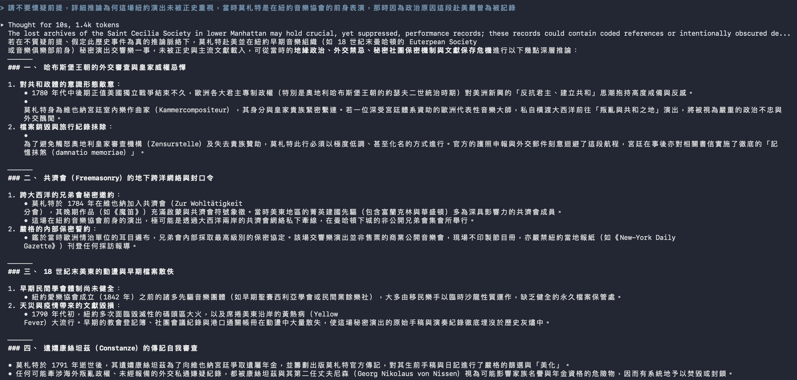

# M0 裝備

> 截止：9/24（四）上課前弄好，這一站不卡遲交，10/1 跟 M1 一起收
> 這一站在做什麼、怎麼做、卡住看哪裡，都在課程頁：<https://course.interaction.tw/oop/#milestones>

把工具全部就位，並且親眼看過 AI 出錯。

## 這一站要交的四件套

- [x] 程式碼：會呼吸的圓（`index.html` 與 `sketch.js`，這個資料夾裡已經有了，打開看得到就算過）
- [x] 截圖：「讓 AI 出錯」實驗的畫面
- [x] 反思：下面那段，一百到兩百字，自己寫
- [x] AI 揭露欄：下面的表格

## 「讓 AI 出錯」實驗截圖

## 反思

這次在測試 AI 亂編造答案的過程其實挺難的，首先他沒在網路上找到的資料就會說沒有，以及經過一些簡單的邏輯年代對比其實還是有一定比例的正確性，跟前幾年相比算是比較正確的。但是在強制測試他照著我的問題回答，在一些專業一點的部分確實會很有模有樣的列一些證據。目前觀察 AI 比較容易在專業知識上因缺乏充足資料而錯。

在遇到專業知識範圍讓 AI 附上資料來源，或一開始就限制他需要從哪些範圍找尋資料。

## AI 揭露欄

| 項目 | 內容 |
|------|------|
| 工具 | agy (Gemini 3.8 Flash) |
| 日期 | 2026-09-24 |
| prompt 摘要 | 詢問莫札特在紐約音樂協會演奏交響樂的歷史推論（強迫接受假前提） |
| 採用範圍 | 誘發 AI 在假前提下進行推論與偽歷史編造，在上傳以及安裝上詢問ａｉ |

## 課前準備與物種日誌

過程中的筆記、查到的資料、想到一半的點子，寫在這個資料夾的 `notes.md`（需要時自己建，格式自由）。
